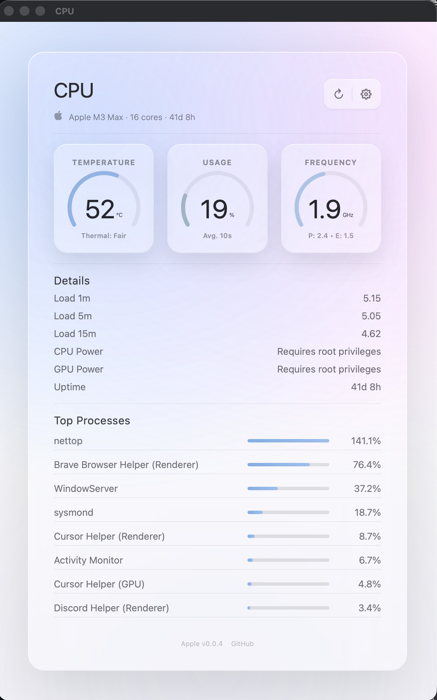
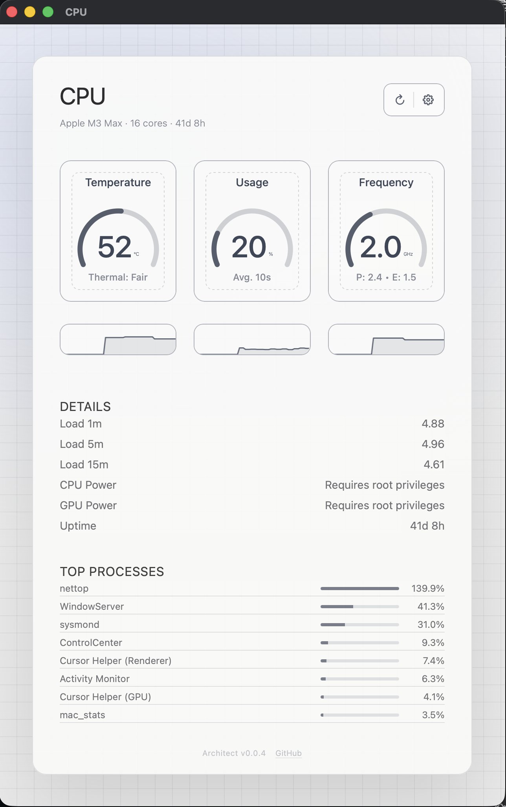
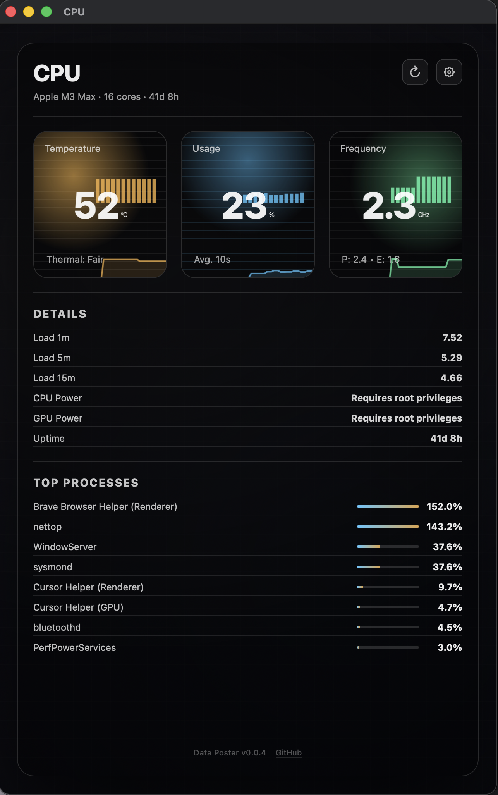
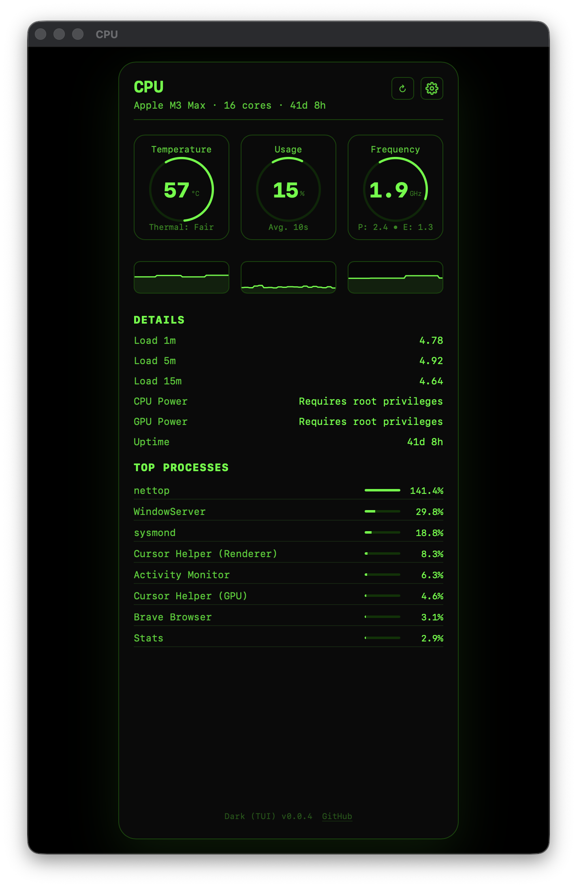
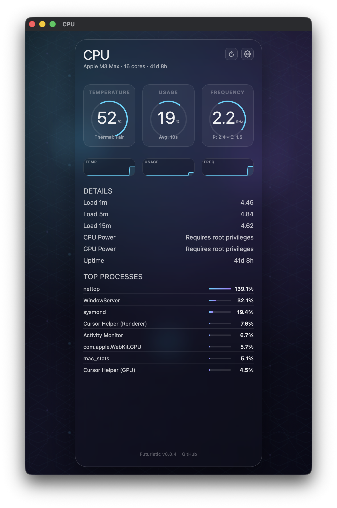
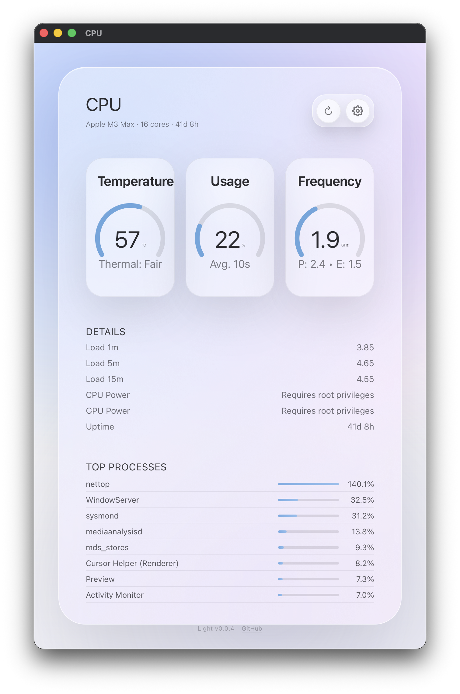
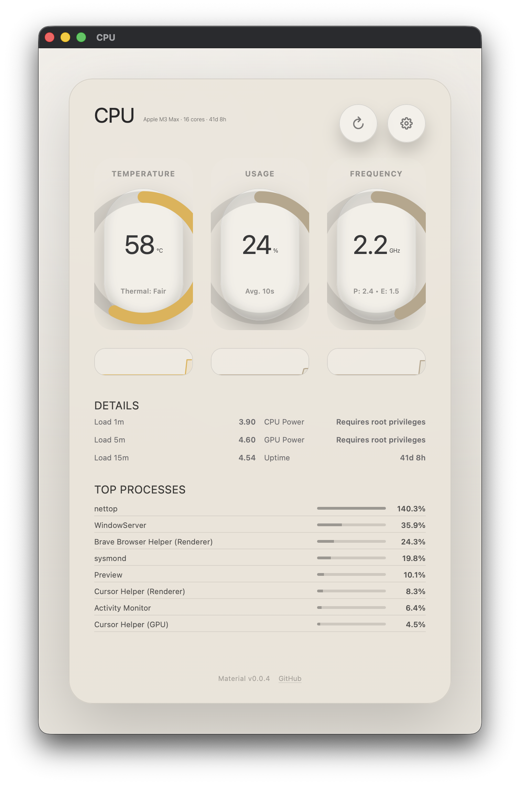
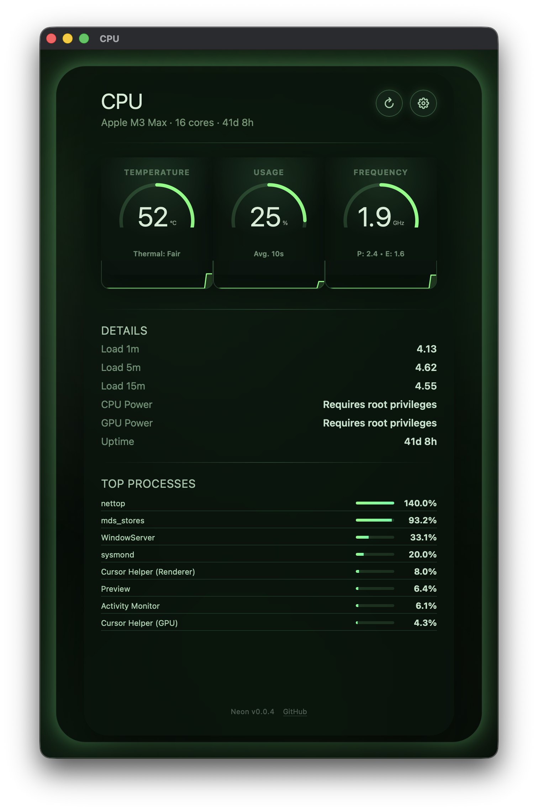
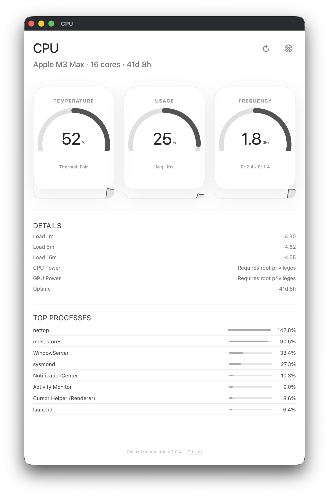
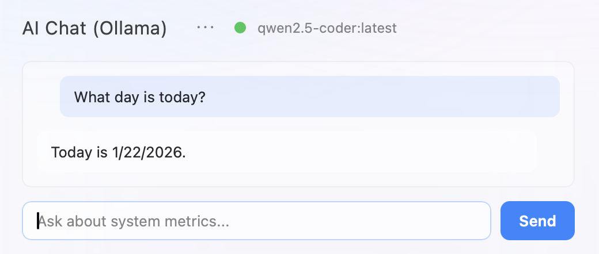

# mac-stats

A calm, high-fidelity system monitor for macOS built with Rust and Tauri. It tells you when something matters — and stays quiet otherwise.



📋 [View Changelog](CHANGELOG.md)

## Inspiration

This project is inspired by [Stats](https://github.com/exelban/stats) by [exelban](https://github.com/exelban), a popular macOS system monitor with 35.8k+ stars.

Other remarkable macOS system monitoring projects:
- **[NeoAsitop](https://github.com/op06072/NeoAsitop)** - Command-line monitoring tool for Apple Silicon Macs, inspired by asitop but sudoless (no root required). Provides real-time CPU/GPU utilization, frequency, power consumption, temperature, and memory bandwidth monitoring. *(Last commit: 2024-07-16)*
- **[EMG](https://github.com/cyrilzakka/EMG)** - macOS system monitor by [cyrilzakka](https://github.com/cyrilzakka) *(Last commit: 2024-11-22)*
- **[XRG](https://github.com/mikepj/XRG)** - Open-source system monitor displaying CPU, GPU, memory, network, disk I/O, temperature, battery status, weather, and stock data in a clean, minimal interface. Available via Homebrew. *(Last commit: 2024-03-15)*

### Motivation

This work was motivated by two main factors:

1. **CPU Usage Optimization**: While Stats is an excellent application, I noticed that CPU usage remained relatively high even when all windows were closed and only menu bar updates were needed. This project aims to achieve lower CPU usage (<1%) while maintaining real-time monitoring capabilities.

2. **Rust Implementation**: I wanted to explore building a system monitor using Rust instead of Swift, leveraging Rust's performance characteristics and safety guarantees.

### Development Note

This project was developed through "vibe coding" - building features iteratively based on what felt right at the time. I have no prior experience with Rust, so this has been a learning journey. The codebase may not follow all Rust best practices, but it works and achieves the goal of efficient system monitoring.

## Features

### System monitoring
- Real-time CPU, RAM, Disk, and GPU monitoring
- Temperature readings (SMC integration)
- CPU frequency monitoring (IOReport)
- Power consumption monitoring (CPU and GPU power in watts)
- Battery monitoring (battery level and charging status)
- Process list with top CPU consumers (clickable for details)
- Process details modal (PID, memory, disk I/O, user info, etc.) and force quit
- Low CPU usage: <0.1% with window closed, ~3% with window open

### Website & monitoring
- Website uptime and social media monitoring with response time tracking
- Alert system (rules and channels)

### AI & agents (Ollama)
- **AI Chat (Ollama)** — Chat about system metrics using a local Ollama instance; supports code execution (JavaScript), context-aware **FETCH_URL**, **BRAVE_SEARCH**, and optional **RUN_CMD** (local commands). **RUN_CMD retry**: when a local command fails, the AI corrects and retries (up to 3 times).
- **Long-term memory** — Global `~/.mac-stats/agents/memory.md` and per-agent `memory.md`; loaded into every agent’s prompt. **MEMORY_APPEND** tool lets the AI save lessons learned (global or per-agent). Session compaction automatically extracts lessons from long conversations and appends them to memory.
- **Session compaction** — When conversation history exceeds 8 messages, it is compacted into a short summary; lessons are written to memory. A **30-minute background job** compacts all in-memory sessions into memory, replaces active sessions with the summary, and clears inactive ones (no activity for 30 min). Session files live under `~/.mac-stats/session/`.
- **Discord bot** — Optional bot (Gateway) for DMs and @mentions. **Channel modes** (`~/.mac-stats/discord_channels.json`): `mention_only` (default), `all_messages`, or **having_fun** (respond to everyone including other bots, with configurable random delays and idle thoughts). Replies use the full Ollama + tools pipeline; can call the **Discord HTTP API** (list guilds/channels/members, send messages). **Having_fun**: time-of-day awareness (e.g. calmer at night), fetches latest channel messages before replying for better flow. Records user display names for personalized replies. CLI: `mac_stats discord send <channel_id> <message>` to post from scripts.
- **MCP agent** — Use tools from any MCP server (HTTP/SSE or stdio); configure via `MCP_SERVER_URL` or `MCP_SERVER_STDIO`; available in Discord, scheduler, and CPU window chat.
- **Tasks** — Task files under `~/.mac-stats/task/` with **TASK_LIST**, **TASK_SHOW**, **TASK_APPEND**, **TASK_STATUS**, **TASK_CREATE**, **TASK_ASSIGN**, **TASK_SLEEP**. Assignees (scheduler, discord, cpu, default); dependencies; review loop closes stale WIP tasks. Scheduler can run a task until finished and optionally post results to a Discord channel.
- **Scheduler** — Run tasks on a schedule (`~/.mac-stats/schedules.json`); cron or one-shot; tasks go through Ollama + tools; optional `reply_to_channel_id` to send results to Discord.
- **PYTHON_SCRIPT agent** — Ollama can create and run Python scripts under `~/.mac-stats/scripts/` (disable with `ALLOW_PYTHON_SCRIPT=0`).
- **Skills** — Markdown files in `~/.mac-stats/skills/` for different “agent” personalities; optional per-model context and temperature/num_ctx overrides.
- **LLM agents** — Directory-based agents under `~/.mac-stats/agents/` (orchestrator, general assistant, coder, generalist, Discord expert, etc.); each has its own model (or `model_role`: general/code/small), skill, optional mood and soul, and memory. **AGENT:** tool delegates to a chosen agent. Model catalog auto-resolves roles from installed Ollama models.
- **Externalized prompts** — System prompts (planning, execution, soul) are editable Markdown under `~/.mac-stats/prompts/` and `~/.mac-stats/agents/soul.md`. Changes take effect immediately without rebuild.
- **Chat commands** — Type `--cpu` to toggle the CPU window, `-v`/`-vv`/`-vvv` to change log verbosity at runtime.
- **Auto-detection** — Ollama model auto-detected at startup from installed models; override with `OLLAMA_MODEL` in env or `~/.mac-stats/.config.env`.

### UI
- Menu bar integration
- Status icon dashboard with real-time indicators (monitors, Ollama, etc.)
- Modern, customizable UI themes (9 themes available)
- Scrollable and collapsible sections for monitoring and AI chat

### Known Limitations

- **Window Frame Toggle**: The "Window Frame" setting in the settings modal affects newly created windows. Existing windows will not update their decorations until they are closed and reopened. The preference is saved to `~/.mac-stats/config.json` and persists across app restarts.

## Installation

### Download DMG (Recommended)

Download the latest release DMG from [GitHub Releases](https://github.com/raro42/mac-stats/releases/latest).

> **💡 TIP: "DMG is damaged" message?**  
> **This is NOT a real problem!** macOS Gatekeeper is blocking the unsigned app (normal for open-source apps).  
> **The DMG is perfectly fine** — you just need to tell macOS it's safe to open. See solutions below ⬇️

**If macOS says the DMG is "damaged" or "can't be opened":**

This is macOS Gatekeeper blocking unsigned applications. This is completely normal for open-source apps that aren't code-signed. **The DMG is not actually damaged** — macOS is just being cautious. Here's how to fix it:

**Option 1: Right-click method (Easiest) ⭐ Recommended**
1. **Right-click** (or Control+click) the downloaded DMG file
2. Select **"Open"** from the context menu
3. Click **"Open"** in the security dialog that appears
4. The DMG will now open normally

**Option 2: Terminal method**
```bash
# Remove quarantine attribute (replace with your actual DMG path)
xattr -d com.apple.quarantine ~/Downloads/mac-stats_*.dmg

# Then double-click the DMG to open it
```

Once the DMG opens, drag `mac-stats.app` to your Applications folder.

**After installing, if macOS blocks the app from opening:**

If macOS shows a message that the app "can't be opened because it is from an unidentified developer" or similar Gatekeeper warnings, remove the quarantine attribute:

```bash
xattr -rd com.apple.quarantine /Applications/mac-stats.app
```

After running this command, you should be able to open the app normally from Applications or Launchpad.

### Build from Source

Top choice (no clone needed):
```bash
curl -fsSL https://raw.githubusercontent.com/raro42/mac-stats/refs/heads/main/run -o run && chmod +x run && ./run
```

Clone the repo (optional):
```bash
git clone https://github.com/raro42/mac-stats.git
cd mac-stats
./run
```

Run from anywhere (clones the repo if needed):
```bash
./run
```

Manual steps:
1. `cd src-tauri`
2. `cargo build --release`
3. Run `./target/release/mac_stats`

## Auto-start on Login

Use launchd or add to Login Items manually.

## Usage

### Opening and Closing the Monitoring Window

The monitoring window displays detailed CPU, temperature, frequency, and process information. Here's how to control it:

**Opening the Window:**
- Click on any percentage value in the menu bar (CPU, GPU, RAM, or Disk)
- The window will appear and stay on top of other windows

**Closing/Hiding the Window:**
- Press **⌘W** (Command+W) to hide the window
- Click on the menu bar percentages again to toggle the window
- Press **⌘Q** (Command+Q) to completely quit the application

### CPU Usage Behavior

mac-stats is designed to be extremely efficient:

- **Window Closed (Menu Bar Only)**: Uses **less than 0.1% CPU**
  - Perfect for background monitoring
  - Menu bar updates every 1-2 seconds with minimal overhead

- **Window Open**: Uses approximately **~3% CPU**
  - Real-time graphs and metrics are displayed
  - Window updates every 1 second

- **Process List Refresh**: CPU usage may spike to **~6%** temporarily
  - Occurs every 15 seconds when the top process list refreshes
  - Duration and intensity depend on your hardware and number of processes
  - This is normal behavior and quickly returns to ~3%

**Tip**: For minimal CPU usage, keep the window closed when you don't need detailed monitoring. The menu bar provides all essential metrics at a glance with near-zero overhead.

## Development

### Prerequisites

- Rust

### Run

```bash
./run dev
```

## Screenshots / Roadmap

### Current Features

- ✅ CPU monitoring window with real-time usage graphs
- ✅ Temperature monitoring (SMC integration)
- ✅ Power consumption monitoring (CPU and GPU)
- ✅ Battery monitoring with charging status
- ✅ Website & Social Media Monitoring with uptime tracking
- ✅ AI Chat (Ollama) with FETCH_URL, BRAVE_SEARCH, RUN_CMD, code execution
- ✅ Long-term memory (global + per-agent, MEMORY_APPEND, session compaction → memory)
- ✅ Session compaction (on-request at 8 msgs + 30-min periodic; clear inactive sessions)
- ✅ Discord bot (Gateway + Discord API tool, user names, channel modes)
- ✅ Having_fun mode (configurable delays, time-of-day, fetch latest messages before reply)
- ✅ Discord send CLI (`mac_stats discord send <channel_id> <message>`)
- ✅ MCP agent (external MCP server tools)
- ✅ Task agent (task files, TASK_* tools, assignees, dependencies, scheduler task loop)
- ✅ PYTHON_SCRIPT agent (run Python scripts from Ollama)
- ✅ Scheduler (cron/at, optional Discord reply channel)
- ✅ Skills and per-model context/params
- ✅ LLM agents (orchestrator, assistant, coder, generalist, Discord expert; model_role resolution)
- ✅ Externalized prompts (editable planning, execution, soul files)
- ✅ RUN_CMD retry with AI-assisted error correction
- ✅ Status Icon Dashboard with real-time indicators
- ✅ Process list (refreshes every 15s, clickable for details) and force quit
- ✅ Menu bar integration
- ✅ Customizable themes (9 themes: Apple, Architect, Data Poster, Dark, Futuristic, Light, Material, Neon, Swiss Minimalistic)
- ✅ System resource monitoring (CPU, RAM, Disk, GPU)
- ✅ Scrollable and collapsible sections
- ✅ Low CPU usage optimizations

### Theme Gallery

mac-stats comes with 9 beautiful, customizable themes:

<table>
<tr>
<td><strong>Apple</strong><br></td>
<td><strong>Architect</strong><br></td>
<td><strong>Data Poster</strong><br></td>
</tr>
<tr>
<td><strong>Dark (TUI)</strong><br></td>
<td><strong>Futuristic</strong><br></td>
<td><strong>Light</strong><br></td>
</tr>
<tr>
<td><strong>Material</strong><br></td>
<td><strong>Neon</strong><br></td>
<td><strong>Swiss Minimalistic</strong><br></td>
</tr>
</table>

### Feature Screenshots

#### AI Chat Integration (Ollama)

Chat with AI about your system metrics using a local Ollama instance. Ask questions about your CPU usage, processes, and system health.

**Core chat** — The CPU window and optional Discord bot use the same Ollama + tools pipeline: **FETCH_URL** (fetch web pages server-side, no CORS), **BRAVE_SEARCH**, **RUN_CMD** (allowlisted commands), JavaScript code execution, and **MCP** (tools from any MCP server). The AI can invoke **AGENT:** to delegate to a specialized agent (orchestrator, coder, Discord expert, etc.).

**Memory & session** — Long-term memory is stored in `~/.mac-stats/agents/memory.md` (global) and per-agent `memory.md`. The AI can save lessons with **MEMORY_APPEND**. Long conversations are automatically compacted: after 8 messages, history is summarized and lessons are written to memory; a 30-minute background job does the same for all sessions and clears inactive ones so the session folder stays manageable.

**Discord** — Configure the bot via token (env, `~/.mac-stats/.config.env`, or Keychain). Channel modes in `~/.mac-stats/discord_channels.json`: respond only to @mentions, to every human message, or use **having_fun** for casual channels (configurable random delays, time-of-day awareness, and fetching the latest channel messages before replying for a natural flow). Use `mac_stats discord send <channel_id> <message>` from the CLI to post from scripts.

**Tasks & scheduler** — Create and manage task files under `~/.mac-stats/task/` (TASK_LIST, TASK_CREATE, TASK_STATUS, etc.). The scheduler runs tasks on a cron or one-shot schedule and can post results to a Discord channel. Task review closes stale WIP tasks automatically.

**Agents** — Multiple LLM agents live under `~/.mac-stats/agents/` with their own model, skill, and memory. The orchestrator and others are available via the **AGENT:** tool. Model roles (general, code, small) are resolved from your installed Ollama models at startup.



### Planned Features

- [ ] Additional monitoring metrics
- [ ] Export/import settings
- [ ] More theme customization options
- [ ] Performance optimizations

## Notes

- **Menu bar updates**: Every 1-2 seconds
- **CPU window updates**: Every 1 second
- **Process list refresh**: Every 15 seconds (click any process for instant details)
- **Process details modal**: Auto-refreshes every 2 seconds while open
- **Window behavior**: Always stays on top when open
- **Accuracy**: Verified against Activity Monitor
- **Performance**: Built with Tauri for native performance

---

## Contact

Have questions, suggestions, or want to contribute? Reach out to me on [Discord](https://discord.com/users/687953899566530588) or open an issue on GitHub.
