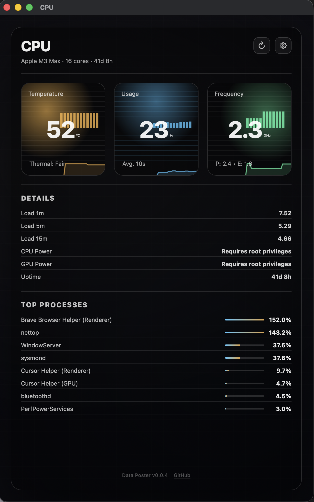

# mac-stats

**The AI agent that just gets it done. All local.**

[](https://github.com/raro42/mac-stats/releases/latest)

A local AI agent for macOS: Ollama chat, Discord bot, task runner, scheduler, and MCP—all on your Mac. No cloud, no telemetry. Sits in your menu bar and shows CPU, GPU, RAM, and disk when you need it. Built with Rust and Tauri.



📋 [Changelog](CHANGELOG.md) · 📸 [Screenshots & themes](screens/README.md)

---

## Quick install

**DMG (recommended):** [Download latest release](https://github.com/raro42/mac-stats/releases/latest) → drag to Applications.

**Build from source:**
```bash
curl -fsSL https://raw.githubusercontent.com/raro42/mac-stats/refs/heads/main/run -o run && chmod +x run && ./run
```

*If macOS says the DMG is "damaged":* Right-click → **Open** (Gatekeeper blocks unsigned apps; the file is fine). Or: `xattr -d com.apple.quarantine ~/Downloads/mac-stats_*.dmg`

---

## At a glance

- **Menu bar** — CPU, GPU, RAM, disk at a glance; click to open the details window.
- **AI chat** — Ollama in the app or via Discord; FETCH_URL, BRAVE_SEARCH, RUN_CMD, code execution, MCP.
- **Discord bot** — Optional; @mentions, DMs, having_fun mode (let your Mac chat with other bots when bored—yes, it gets weird); full Ollama + tools.
- **Tasks & scheduler** — Task files under `~/.mac-stats/task/`; cron or one-shot; optional Discord reply.
- **All local** — Models and data on your Mac; no cloud backend; works offline.
- **Low CPU** — &lt;0.1% with window closed, ~3% with window open.

---

## All local

- **AI** — Ollama on your Mac; models and inference stay on-device.
- **Your data** — Config, memory, sessions, and tasks in `~/.mac-stats`. Nothing sent to a vendor. Secrets in `~/.mac-stats/.config.env` or Keychain.
- **Optional network** — Discord, FETCH_URL, Brave Search, website checks only when you use them.
- **Metrics** — CPU, GPU, RAM, disk, temperature, processes read from your machine when you open the window.

No subscription. No lock-in. Works offline for chat and monitoring. All you need is a nice pet from [Ollama](https://ollama.com)—the kind that runs on your Mac and never asks for a subscription.

---

## Configuration

All settings live under `~/.mac-stats/`:

```
~/.mac-stats/
├── config.json            # Window decorations, scheduler interval, ollamaChatTimeoutSecs
├── .config.env            # Secrets (Discord token, API keys) — never commit
├── discord_channels.json  # Per-channel modes (mention_only, all_messages, having_fun)
├── escalation_patterns.md # Phrases that trigger “try harder” (e.g. “think harder”, “you are stupid”); user-editable, auto-adds when you complain
├── schedules.json         # Cron and one-shot tasks
├── user-info.json         # Per-user details (Discord id → display_name, notes, timezone)
├── agents/                # LLM agents (orchestrator, coder, etc.), soul.md, memory.md
├── prompts/               # Editable planning_prompt.md, execution_prompt.md
├── skills/                # skill-<n>-<topic>.md for different agent personalities
├── task/                  # Task files (TASK_LIST, TASK_CREATE, TASK_STATUS)
├── scripts/               # PYTHON_SCRIPT output
├── session/               # Conversation sessions (compacted to memory)
├── screenshots/           # BROWSER_SCREENSHOT output
└── debug.log              # App logs (tail -f ~/.mac-stats/debug.log)
```

---

## Commands

| Command | Description |
|---------|-------------|
| `mac_stats` | Start app (menu bar + optional CPU window) |
| `mac_stats --cpu` | Start with CPU window open |
| `mac_stats -v` / `-vv` / `-vvv` | Verbosity levels of debug.log so you see what is happening |
| `mac_stats discord send <channel_id> <message>` | Post message to Discord from CLI |
| `./run dev` | Development mode (hot reload) |

---

## Features

### AI & agents (Ollama, local)
- **Chat** — In the app window or via Discord. Code execution (JS), **FETCH_URL**, **BRAVE_SEARCH**, **RUN_CMD** (allowlisted), retry and correction.
- **Completion verification** — We extract 1–3 success criteria at the start and ask “Did we satisfy the request?” at the end; if not, we append a disclaimer. Heuristic: “screenshot requested but none attached” → note. See [docs/025_expectation_check_design.md](docs/025_expectation_check_design.md).
- **Escalation / “try harder”** — Edit **~/.mac-stats/escalation_patterns.md** (one phrase per line). When your message contains one (e.g. “think harder”, “you are stupid”), we run a stronger completion pass (+10 tool steps). New phrases you use get auto-added.
- **Memory** — Global and per-agent `memory.md`; **MEMORY_APPEND**; session compaction writes lessons to memory.
- **Discord bot** — Optional. @mentions, DMs, or having_fun mode (your Mac chats with other bots when bored); per-channel model/agent. Full Ollama + tools.
- **Tasks** — `~/.mac-stats/task/` with **TASK_LIST**, **TASK_CREATE**, **TASK_STATUS**, assignees, scheduler loop.
- **Scheduler** — Cron or one-shot (`~/.mac-stats/schedules.json`); tasks through Ollama; optional Discord reply channel.
- **MCP** — Tools from any MCP server (HTTP/SSE or stdio).
- **Agents** — Multiple LLM agents under `~/.mac-stats/agents/` (orchestrator, coder, Discord expert, etc.); **AGENT:** delegates. Editable prompts in `~/.mac-stats/prompts/` and `soul.md`.
- **cursor-agent** — When the [Cursor Agent CLI](https://cursor.com) is on PATH, agents can delegate via **CURSOR_AGENT:** or **RUN_CMD: cursor-agent**; see [docs/012_cursor_agent_tasks.md](docs/012_cursor_agent_tasks.md).
- **PYTHON_SCRIPT** — Ollama can run Python under `~/.mac-stats/scripts/` (disable with `ALLOW_PYTHON_SCRIPT=0`).

### UI
- Menu bar + expandable window; status dashboard (monitors, Ollama, etc.); 9 themes. Scrollable, collapsible sections.

### System monitoring (background)
- Real-time CPU, RAM, disk, GPU in the menu bar; temperature, frequency, battery. Process list with top consumers; click for details. Low CPU: &lt;0.1% with window closed, ~3% with window open.
- **Monitoring & alerts** — Website and social monitoring; alert rules and channels (Telegram, Slack, etc.).

---

## Usage

- **Chat** — Open the window (click the menu bar icon or run with `--cpu`) and use the AI panel. Verbosity: `-v` / `-vv` / `-vvv`.
- **Discord** — Configure `~/.mac-stats/discord_channels.json` and ensure your bot token is set; the agent responds to @mentions, DMs, or in having_fun channels (where your Mac can chill and talk to other bots). See [Discord setup and channel modes](docs/007_discord_agent.md) for details.
- **Monitoring** — Click any percentage in the menu bar (CPU, GPU, RAM, Disk) to open the details window. ⌘W to hide; click again to toggle; ⌘Q to quit. CPU use: &lt;0.1% with window closed, ~3% with window open.

---

## Installation (detailed)

### DMG
Download the latest [mac-stats release](https://github.com/raro42/mac-stats/releases/latest) and drag the app to Applications.

**If the app is blocked after install:**
```bash
xattr -rd com.apple.quarantine /Applications/mac-stats.app
```

### Build from source
```bash
git clone https://github.com/raro42/mac-stats.git
cd mac-stats
./run
```

Manual: `cd src-tauri && cargo build --release` then run `./target/release/mac_stats`.

---

## Development

**Prerequisites:** Rust

```bash
./run dev
```

Run `cargo audit` (if available) in `src-tauri/` before release to check for known vulnerabilities.

### Agent workflow
This repo is edited by the mac-stats-reviewer Coder agent in place (yolo mode). For direct edits, open Cursor with **`mac-stats-agent-workspace.code-workspace`** (in the mac-stats-reviewer repo) so both repos are in the workspace; then the Coder can edit files here directly. See [docs/agent_workflow.md](docs/agent_workflow.md).

---

## Inspiration & notes

Local AI agent stack first; system monitoring lives in the menu bar when you need it. Inspired by [Stats](https://github.com/exelban/stats) by exelban (low CPU, native metrics), [OpenClaw](https://github.com/openclaw/openclaw), [browser-use](https://github.com/browser-use/browser-use), and [Hermes](https://github.com/NousResearch/hermes-agent) by Nous Research. Built with Rust + Tauri; metrics use libproc, SMC, IOReport where appropriate.

- Menu bar: refresh every 1–2s | Window: 1s | Process list: 15s

---

## Contact

Questions or ideas? [Discord](https://discord.com/users/687953899566530588) or open an issue on GitHub.

**We’d love your feedback.** If you’ve tried mac-stats—or you’re thinking about it—drop a note in [**this discussion**](https://github.com/raro42/mac-stats/issues/3). What works, what doesn’t, and what you’d like to see next. It all helps.

---

[MIT License](https://opensource.org/licenses/MIT)
