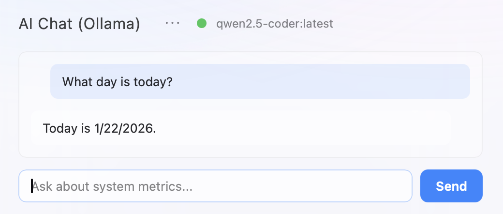

# mac-stats

**Local AI agent harness + menu-bar stats — on your Mac. No cloud telemetry.**

[](https://github.com/raro42/mac-stats/releases/latest)
[](https://github.com/raro42/mac-stats/actions/workflows/release.yml)
[](https://github.com/raro42/mac-stats/actions/workflows/ci.yml)

> **Requirements**
>
> - **macOS on Apple Silicon** (arm64). Published DMG / Homebrew cask are **not** for Intel Macs.
> - **[Ollama](https://ollama.com) installed** with at least one model, e.g.
>   ```bash
>   curl -fsSL https://ollama.com/install.sh | sh
>   ollama pull llama3.2
>   ```
> - Rust / Tauri only if you **build from source** (see below).

Rust + Tauri menu-bar app: live CPU/GPU/RAM/disk, and a **local Ollama** agent (Werner) with tools, Discord, tasks, and scheduler — data stays under **`~/.mac-stats/`**.

📋 [Changelog](CHANGELOG.md) · 📘 [Docs index](docs/README.md) · 🍺 [Homebrew](docs/homebrew.md) · 📸 [More screenshots](screens/README.md)

---

## Quick start (≈60 seconds)

1. **Install**
   ```bash
   brew tap raro42/mac-stats https://github.com/raro42/mac-stats
   brew install --cask mac-stats
   ```
   Or download the [latest DMG](https://github.com/raro42/mac-stats/releases/latest) and drag **mac-stats** to Applications.
2. **Open** the app — a menu-bar icon shows live stats.
3. **Click** the icon → open the window → **AI Chat (Ollama)** → ask something.

If chat is empty: run `ollama list` and ensure Ollama is running. Full walkthrough: [docs/QUICKSTART.md](docs/QUICKSTART.md).

<p>
  
  
  
</p>

---

## Install options

| Method | Command / link |
|--------|----------------|
| **Homebrew cask** | `brew tap raro42/mac-stats https://github.com/raro42/mac-stats && brew install --cask mac-stats` |
| **DMG** | [Releases](https://github.com/raro42/mac-stats/releases/latest) |
| **Source (pinned)** | See [Build from source](#build-from-source) — prefer a release tag + checksum, not a raw `curl \| bash` of `main` |

**Gatekeeper:** Prefer notarized builds ([docs/NOTARIZATION.md](docs/NOTARIZATION.md)). Until CI notarization is fully wired, Right-click → **Open** on first launch. Avoid random `xattr` advice from the internet; only clear quarantine for a DMG you downloaded from this GitHub repo.

### Build from source

```bash
git clone https://github.com/raro42/mac-stats.git
cd mac-stats
git checkout v0.1.88   # pin to a release tag when possible
./run
```

**Prerequisites:** Rust stable, Xcode CLT. This is a **macOS Tauri** app (not Linux webkit packages).

Verify a release DMG checksum:

```bash
./scripts/print-release-checksums.sh v0.1.88
```

One-liner from `main` (`curl …/run`) is convenient for contributors but **not** recommended for production installs — use Homebrew, DMG, or a **tagged** commit.

---

## Privacy

- **No cloud telemetry.** Metrics, chats, agents, tasks, and logs stay in **`~/.mac-stats/`**.
- Inference is **local Ollama** unless you point at a remote endpoint yourself.
- Secrets: `~/.mac-stats/.config.env` and/or **Keychain** (Discord, Perplexity). Never commit `.config.env`. Details: [docs/CONFIG.md](docs/CONFIG.md).

---

## Updates

The app can check GitHub Releases for a newer version (banner in the CPU window). You can also:

```bash
brew upgrade --cask mac-stats
```

or download a new DMG from [Releases](https://github.com/raro42/mac-stats/releases).

---

## Full features

### Menu bar & glass UI

- **CPU, GPU, RAM, and disk** in the menu bar; window for temperature, frequency, battery, process list.
- **Nine themes**, collapsible sections, **Agent Ops** command center.
- Low idle overhead (~0.5% CPU menu-bar only).

### Local AI agent (Ollama)

- Direct harness by default; native tool schemas; Discord (Werner); FETCH_URL, Brave, Perplexity, browser CDP, RUN_CMD, tasks, scheduler, MCP.
- Parity notes: [docs/039_werner_harness_parity.md](docs/039_werner_harness_parity.md).

### Discord, tasks, scheduler, monitoring

- Bot modes, markdown tasks, cron schedules, website/social monitors and alerts.

### Configuration

All under `~/.mac-stats/` — see [docs/CONFIG.md](docs/CONFIG.md).

### Commands

| Command | Description |
|---------|-------------|
| `mac_stats` | Start app |
| `mac_stats --cpu` | Start with window open |
| `mac_stats -vv` | Verbose debug.log |
| `./run dev` | Dev mode from repo |

### Development

Rust + `./run dev`. Contributor workflow: [docs/agent_workflow.md](docs/agent_workflow.md). Design history: [docs/design/](docs/design/).

---

## Inspiration

Aligned with [OpenClaw](https://github.com/openclaw/openclaw) / [Hermes](https://github.com/NousResearch/hermes-agent) harness shape; metrics inspired by [Stats](https://github.com/exelban/stats).

---

## Contact

[Discord](https://discord.com/users/687953899566530588) · [Feedback discussion](https://github.com/raro42/mac-stats/issues/3) · GitHub Issues

[MIT License](https://opensource.org/licenses/MIT)
