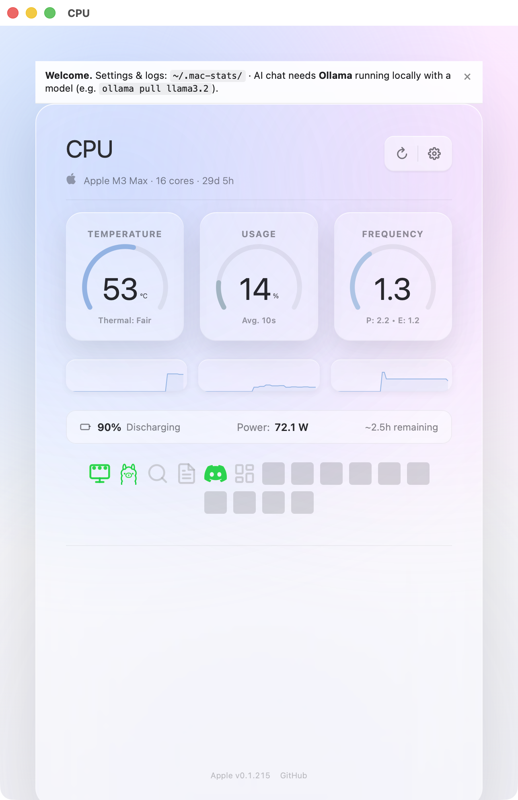
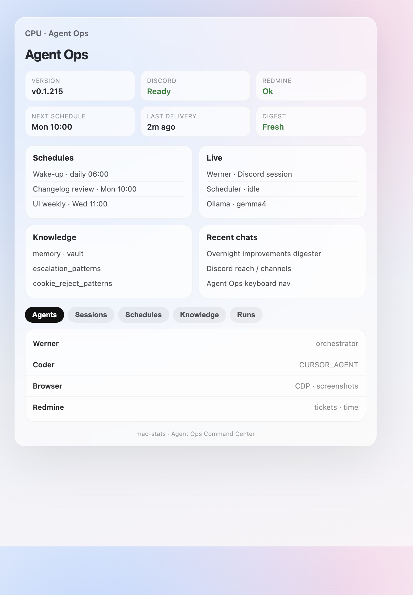
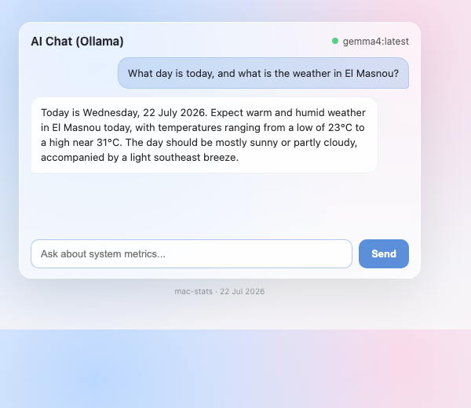
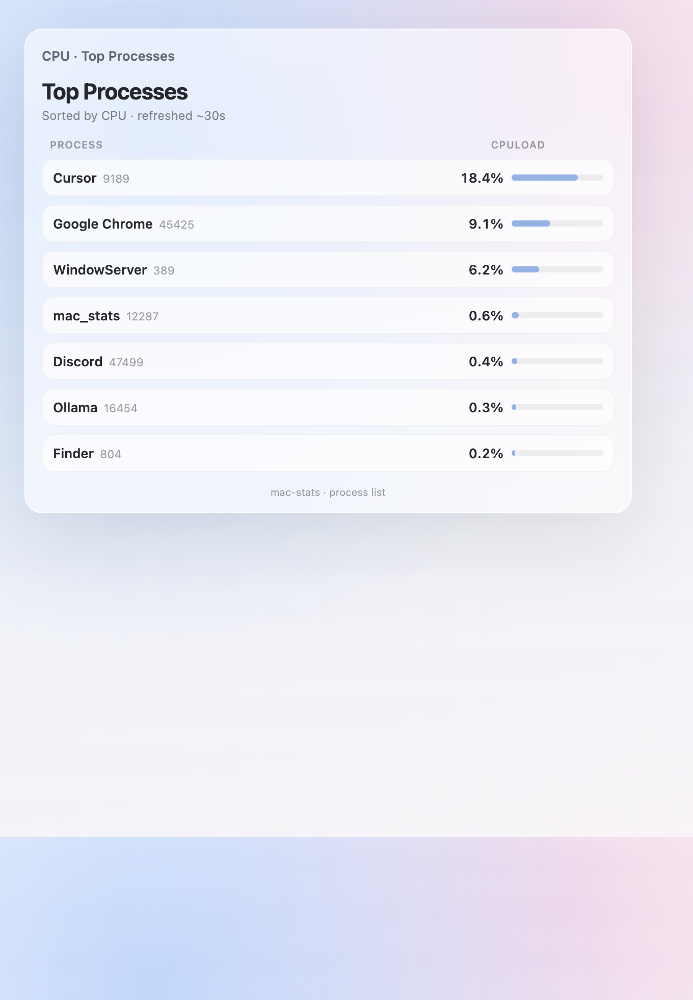

# mac-stats

**Menu-bar system monitor for Apple Silicon (optional local AI agent).**

[](https://github.com/raro42/mac-stats/releases/latest)
[](https://github.com/raro42/mac-stats/actions/workflows/ci.yml)
[](https://github.com/raro42/mac-stats/actions/workflows/release.yml)
[](https://opensource.org/licenses/MIT)

> **Apple Silicon only** (arm64). Intel Macs are not supported by the published DMG / Homebrew cask.

Two products in one binary — pick your path:

| | **Just the monitor** | **Monitor + AI agent** |
|--|----------------------|-------------------------|
| What you get | Menu-bar CPU (and °C when known), glass window, themes, process list | Everything left + local Ollama chat, Discord bot, schedules, Agent Ops |
| Needs | macOS on Apple Silicon | + [Ollama](https://ollama.com) + a model |
| Config | Zero — AI is **off by default** | Set `aiAgentEnabled: true` or use Settings |

📋 [Changelog](CHANGELOG.md) · 📘 [Getting Started](docs/GETTING_STARTED.md) · 🗺 [Roadmap](docs/ROADMAP.md) · 🍺 [Homebrew](docs/homebrew.md) · 🌐 [Landing](docs/site/index.html)

## Table of contents

- [Quick start — Just the monitor](#quick-start--just-the-monitor)
- [Quick start — Monitor + AI agent](#quick-start--monitor--ai-agent)
- [Screenshots](#screenshots)
- [vs. Stats / iStat Menus](#vs-stats--istat-menus)
- [Install options](#install-options)
- [Privacy](#privacy)
- [Updates](#updates)
- [Full features](#full-features)
- [Build from source](#build-from-source)

---

## Quick start — Just the monitor

```bash
brew tap raro42/mac-stats https://github.com/raro42/mac-stats
brew install --cask mac-stats
# or: ./scripts/quickstart.sh   # from a clone; installs + seeds ~/.mac-stats
open -a mac-stats
```

Look at the menu bar → click for the window. **No Ollama required.**

---

## Quick start — Monitor + AI agent

1. Install the app (above).
2. Install Ollama and pull a model:
   ```bash
   curl -fsSL https://ollama.com/install.sh | sh
   ollama pull llama3.2
   ```
3. Enable AI in Settings (**Enable local AI agent**) or:
   ```bash
   # in ~/.mac-stats/config.json
   { "aiAgentEnabled": true, "menuBarCompact": true }
   ```
4. Open the window → **AI Chat (Ollama)** → try: *What's my CPU temp?*

Details: [docs/GETTING_STARTED.md](docs/GETTING_STARTED.md).

---

## Screenshots

### Themes

<p>
  
  
  
</p>

### Features

<p>
  
  
  
  
</p>

### Demo video

[~49s live window capture](screens/mac-stats-features.mp4) — real `mac_stats --cpu` session (ScreenCaptureKit, window-only): live gauges, monitors (including a red down site), Agent Ops, Ollama chat. Letterboxed to 1080p with light voiceover.

Full theme gallery and capture notes: [screens/README.md](screens/README.md).  
Repo: [github.com/raro42/mac-stats](https://github.com/raro42/mac-stats/)

---

## vs. Stats / iStat Menus

| | **mac-stats** | **Stats** | **iStat Menus** |
|--|---------------|-----------|-----------------|
| Menu-bar CPU/RAM/disk | ✅ | ✅ | ✅ |
| Apple Silicon focus | ✅ arm64 only | ✅ | ✅ |
| Themes / glass UI | ✅ | ✅ | ✅ |
| Local LLM agent (Ollama) | ✅ optional | — | — |
| Discord bot / schedules | ✅ optional | — | — |
| Price | Free (MIT) | Free / donate | Paid |
| Cloud telemetry | ❌ none | — | — |

If you only want a Stats-like monitor, stay on the **Just the monitor** path — leave AI disabled.

---

## Install options

| Method | Command / link |
|--------|----------------|
| **Homebrew cask** | `brew tap raro42/mac-stats https://github.com/raro42/mac-stats && brew install --cask mac-stats` |
| **Quick Start script** | `./scripts/quickstart.sh` (clone) — app + `~/.mac-stats` defaults + Ollama check |
| **DMG** | [Releases](https://github.com/raro42/mac-stats/releases/latest) |
| **Source** | Pin a release tag; see [Build from source](#build-from-source) |

**Gatekeeper / notarization:** Prefer signed+notarized builds ([docs/NOTARIZATION.md](docs/NOTARIZATION.md)). Until CI secrets are set, use Right-click → **Open**.

Config templates in repo root: [`config.minimal.json`](config.minimal.json) (monitor-only), [`config.example.json`](config.example.json) (AI enabled).

---

## Privacy

**No cloud telemetry** — everything stays in **`~/.mac-stats/`**. Secrets: Keychain and/or `.config.env` (never commit). See [docs/CONFIG.md](docs/CONFIG.md).

---

## Updates

In-app banner checks GitHub Releases. Or: `brew upgrade --cask mac-stats`.

---

## Full features

### Menu bar & glass UI

- Compact menu bar by default (**CPU** + °C when known); set `menuBarCompact: false` for CPU/GPU/RAM/SSD.
- Nine themes, process list, website monitors (menu bar shows a red **Mon ✕** cue when any site is down).
- ~0.5% idle CPU (menu bar only).

### Local AI agent (opt-in)

- Ollama chat, Discord (Werner), FETCH_URL, Brave, Perplexity, CDP browser, tasks, scheduler, MCP, Agent Ops.
- Off until `aiAgentEnabled: true`.

### Configuration

[`docs/CONFIG.md`](docs/CONFIG.md) · Settings → **Reset to monitor defaults**.

### Commands

| Command | Description |
|---------|-------------|
| `mac_stats` / `open -a mac-stats` | Start |
| `mac_stats --cpu` | Start with window open |
| `mac_stats -vv` | Verbose `debug.log` |

---

## Build from source

```bash
git clone https://github.com/raro42/mac-stats.git
cd mac-stats
git checkout v0.1.216   # pin when possible
./run
```

Requires Rust + Xcode CLT (macOS Tauri). Checksums: `./scripts/print-release-checksums.sh v0.1.216`.

Contributor docs: [docs/design/](docs/design/). Workflow: [docs/agent_workflow.md](docs/agent_workflow.md).

---

## Contact

[Discord](https://discord.com/users/687953899566530588) · [Discussions](https://github.com/raro42/mac-stats/discussions) · [Issues](https://github.com/raro42/mac-stats/issues) · [Feedback](https://github.com/raro42/mac-stats/issues/3)

[MIT License](https://opensource.org/licenses/MIT)
