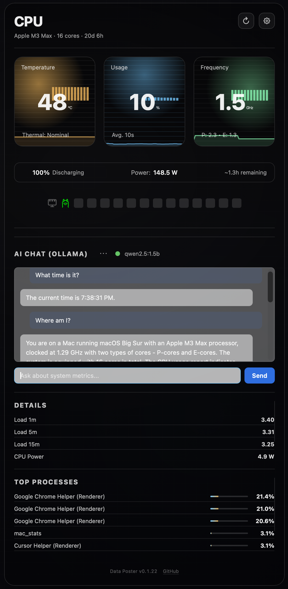
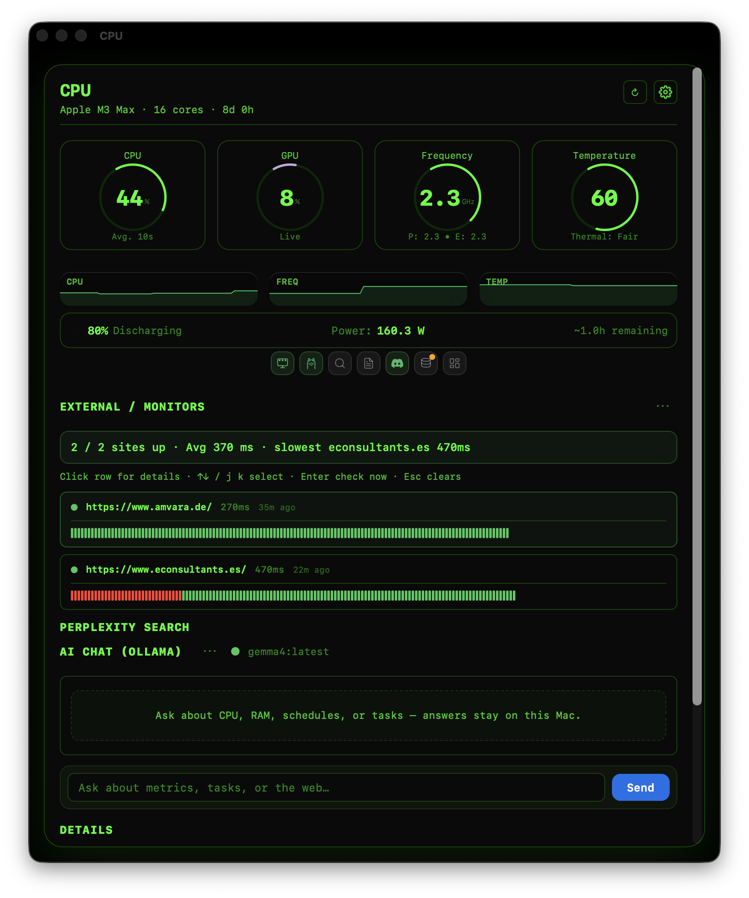
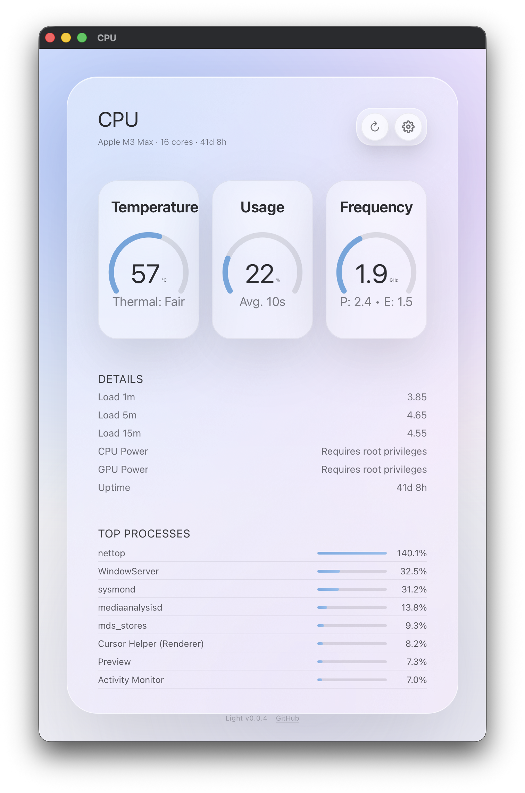
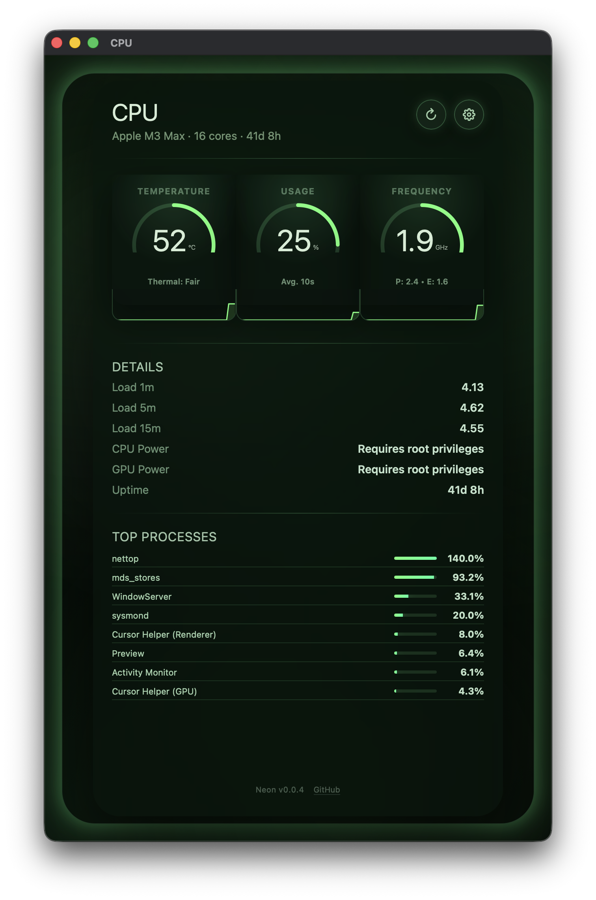
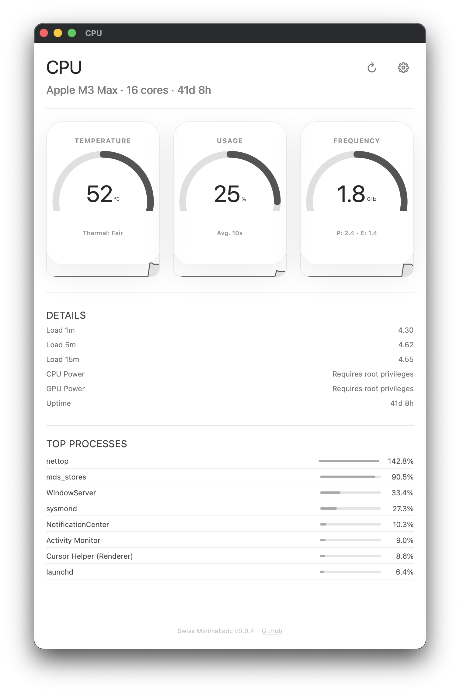
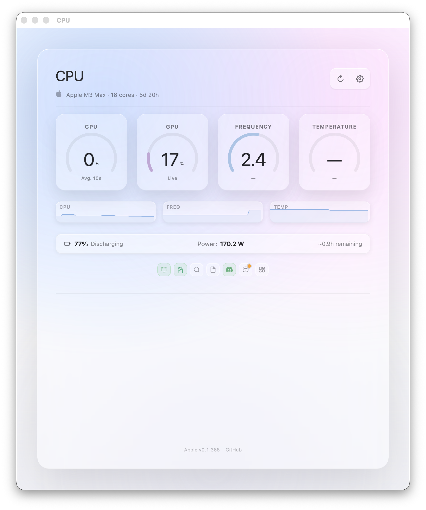
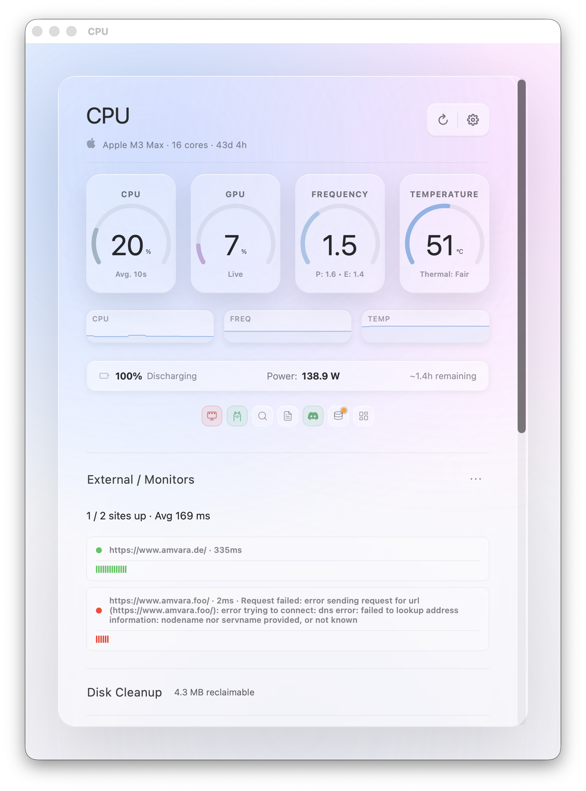
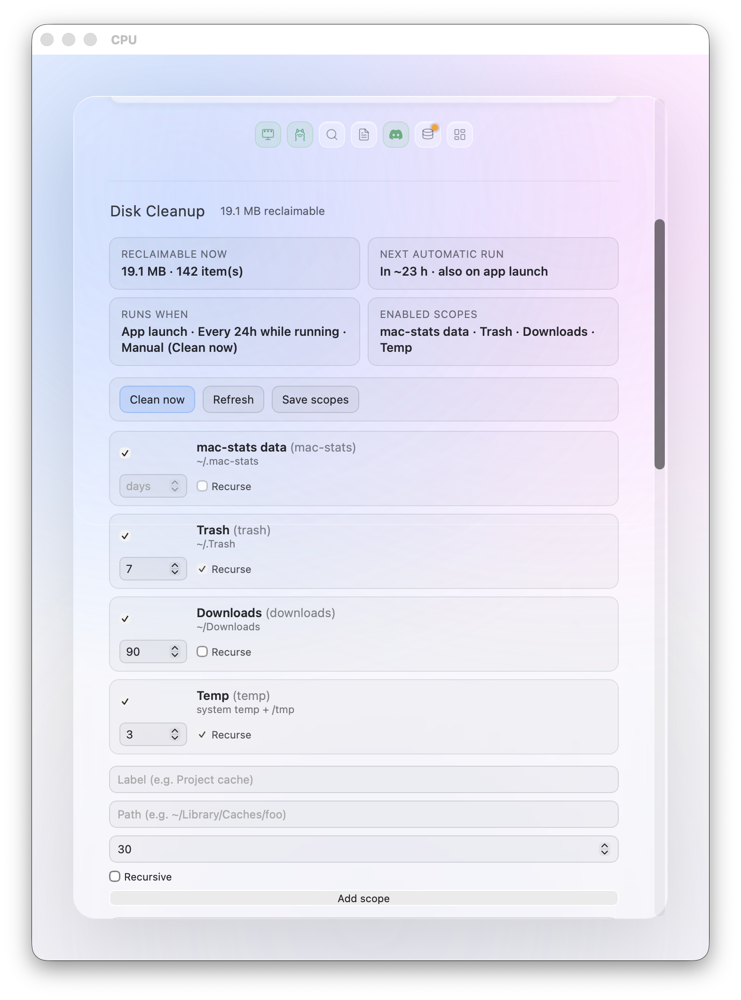
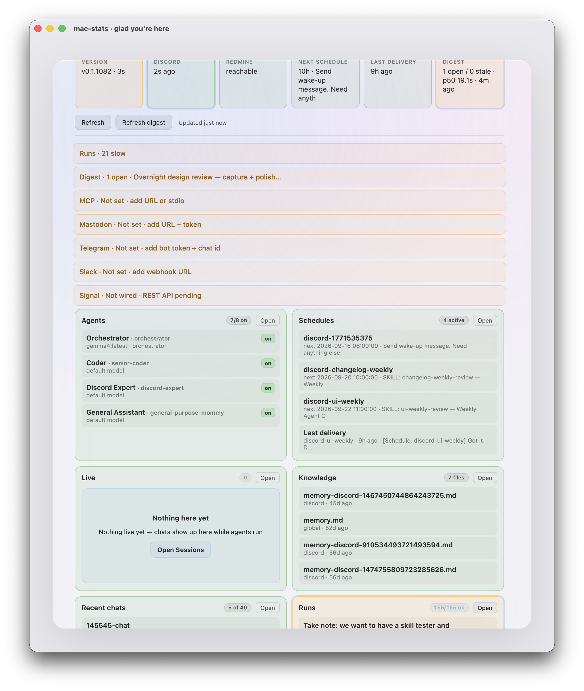
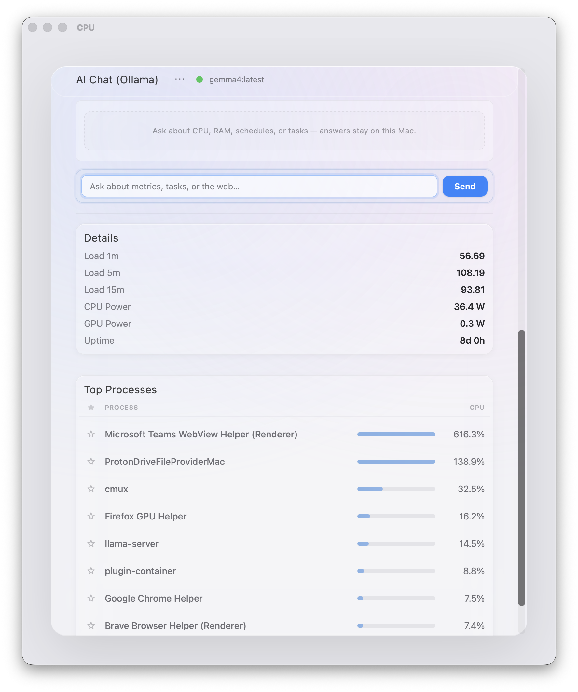

# Screenshots & themes

Screenshots and a short demo reel for [mac-stats](https://github.com/raro42/mac-stats/).

**Privacy:** Capture the **mac-stats window only** (or a dedicated feature page). Never full-desktop grabs — they can include other apps and sensitive content.

## Theme gallery

| Apple | Architect | Data Poster |
|-------|-----------|-------------|
|  |  |  |
| **Dark (TUI)** | **Futuristic** | **Light** |
|  |  |  |
| **Material** | **Neon** | **Swiss Minimalistic** |
|  |  |  |

## Feature screenshots

| CPU metrics | Website monitors |
|-------------|------------------|
|  |  |
| **Disk Cleanup** | **Agent Ops** |
|  |  |
| **AI chat (Ollama)** | **Top processes** |
|  |  |

### Short demo video

[Play demo (~49s)](https://cdn.jsdelivr.net/gh/raro42/mac-stats@main/docs/screens/mac-stats-features.mp4) · [mac-stats-features.mp4](mac-stats-features.mp4) — **live** window-only capture of the running app:

- ScreenCaptureKit recording of the CPU window (not a slideshow of stills)
- Walkthrough: live metrics → website monitors → Agent Ops → Ollama chat → back to metrics
- Letterboxed to 1920×1080; neural voiceover + ambient bed
- Repo: [github.com/raro42/mac-stats](https://github.com/raro42/mac-stats/)

Also linked from the [project README](../../README.md#demo-video).

## How to capture (window-only)

1. Open the CPU window: `mac_stats --cpu` (or click the menu bar item).
2. **Wait at least 30 seconds** with the window open before capturing so the history graphs (temperature / usage / frequency sparklines) have enough samples and look filled-in. Do not shoot on a cold open.
3. Prefer **window capture**, not display capture:
   - ScreenCaptureKit / `screencapture -l <windowid>` for the mac-stats window only
   - Do **not** use `screencapture -D` (full display) for marketing assets
4. Optional helper for ad-hoc local shots: `./scripts/take-screenshot.sh` (full screen — avoid for repo assets).

## Refresh log

- **2026-08-16:** Disk Cleanup soft-delete Saved flash (v0.1.444). Agent Ops filter-miss Clear filter (v0.1.443). Recapture of `feature-agent-ops.png` still deferred if Screen Recording TCC blocks `screencapture -l`.
- **2026-08-15:** Agent Ops active-tab accent wash + clearer on/off badges (v0.1.431). Recapture of `feature-agent-ops.png` deferred again — `screencapture -l` TCC (`could not create image`); prior Aug 12 asset kept.
- **2026-08-15:** Agent Ops overview active-tab highlight + health status wash (v0.1.430). Recapture of `feature-agent-ops.png` deferred — agent-session `screencapture -l/-R` hit TCC (`could not create image`); keep prior asset until a permitted capture.
- **2026-08-14:** Recaptured `feature-monitors.png`, `feature-ai-chat.png`, and `dark-tui.png` (window-only, ≥30s warm-up) after Monitors downtime tips (v0.1.394–397) and dark first-paint (v0.1.398). Open section uses `MAC_STATS_OPEN_SECTION`; installed-app theme lives in WebKit `com.raro42.mac-stats` localStorage (not the legacy `mac_stats` folder). Window owner name for `screencapture -l` is **`mac-stats`**.
- **2026-08-13:** Monitors summary up/down accents + row latency polish (v0.1.373); open with `MAC_STATS_OPEN_SECTION=monitors`. Recapture of `feature-monitors.png` deferred if Screen Recording TCC blocks.
- **2026-08-13:** Disk Cleanup reclaim accent + scope/item hover (v0.1.372); open with `MAC_STATS_OPEN_SECTION=disk-cleanup`. Recapture of `feature-disk-cleanup.png` deferred if Screen Recording TCC blocks.
- **2026-08-13:** Top Processes accent bars + pin header (v0.1.371); open with `MAC_STATS_OPEN_SECTION=processes`. Recapture of `feature-processes.png` deferred if Screen Recording TCC blocks.
- **2026-08-13:** AI Chat composer polish (v0.1.370); `feature-ai-chat.png` recapture deferred (Screen Recording TCC). Open AI Chat with `MAC_STATS_OPEN_SECTION=ai-chat`.
- **2026-08-12:** Recaptured `feature-agent-ops.png` and `feature-cpu-metrics.png` (window-only, ≥30s warm-up). Overnight harness now spawns the Cursor `agent` CLI (print-only ticks were a quiet failure). Open Agent Ops for capture with `MAC_STATS_OPEN_SECTION=agent-ops`.
- **2026-08-05:** Added `feature-monitors.png` (window-only) for External / Monitors (up/down, latency, history bars).
- **2026-08-05:** Added `feature-disk-cleanup.png` (window-only) for configurable cleanup scopes (Trash / Downloads / Temp / custom paths) — v0.1.355+.
- **2026-07-28:** Agent Ops empty-state polish shipped (v0.1.261). Window-only recapture of `feature-agent-ops.png` deferred — agent-session `screencapture` returned black frames (Screen Recording / TCC); keep prior asset until a permitted capture.
- **2026-07-26:** Recaptured `feature-cpu-metrics.png` (window-only, post SSD menu-bar / v0.1.257+).
