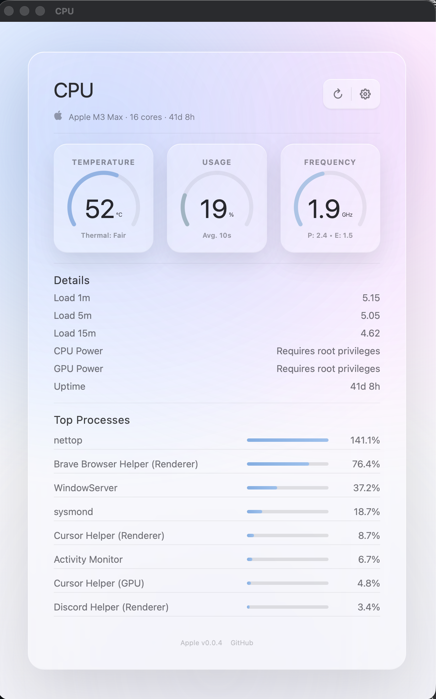
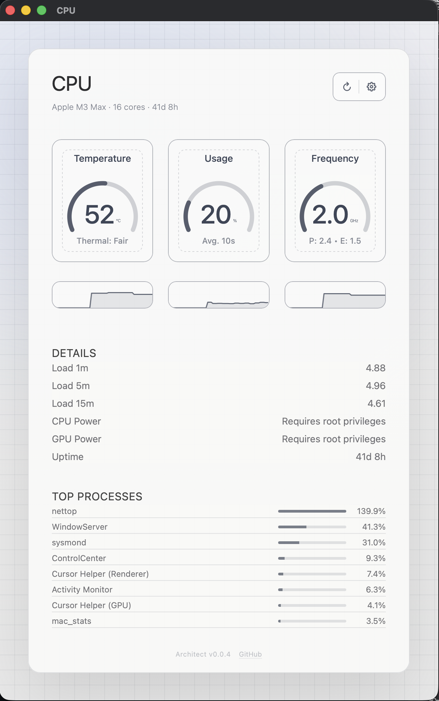
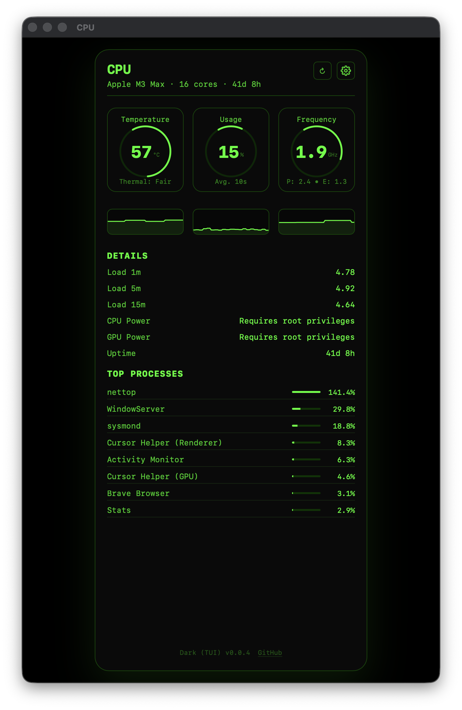
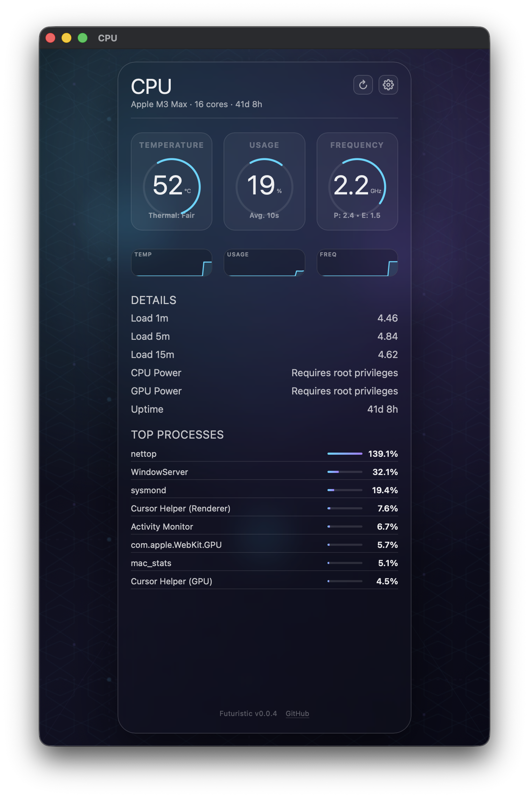
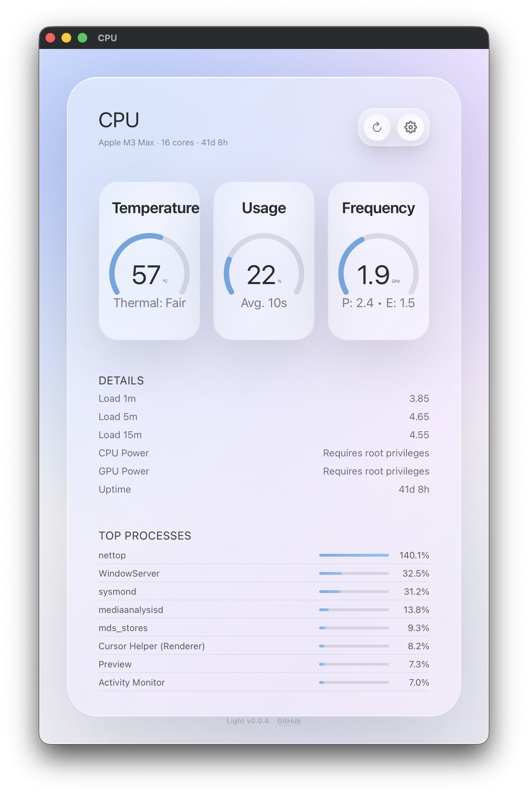
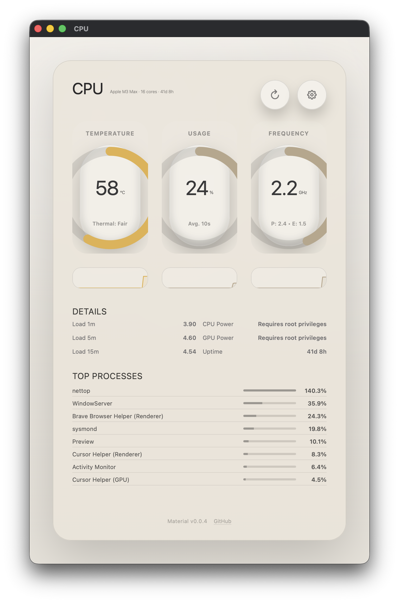
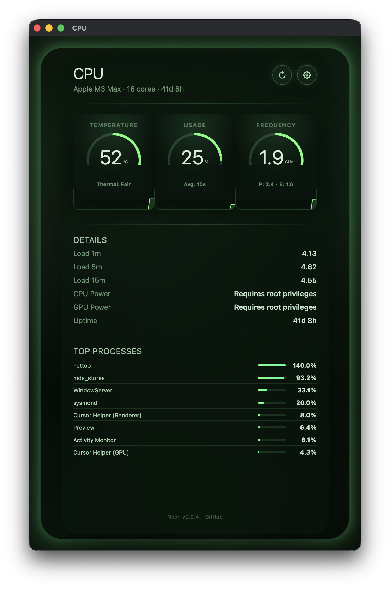
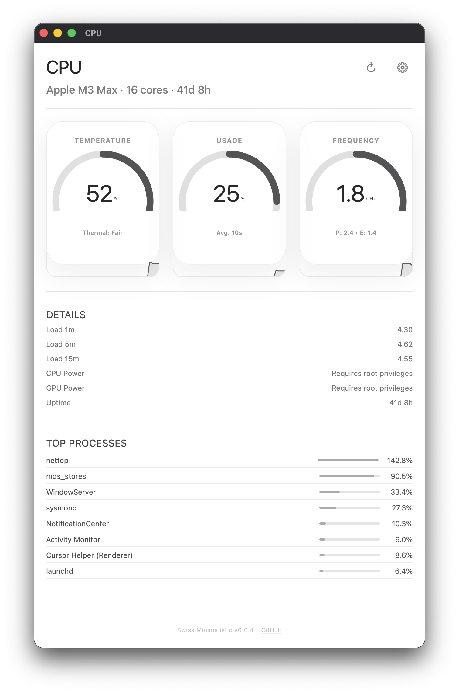

# Screenshots & themes

Screenshots for mac-stats: themes and feature highlights.

## Theme gallery

| Apple | Architect | Data Poster |
|-------|-----------|-------------|
|  |  |  |
| **Dark (TUI)** | **Futuristic** | **Light** |
|  |  |  |
| **Material** | **Neon** | **Swiss Minimalistic** |
|  |  |  |

## Feature screenshots

*(Add feature screens here when available, e.g. AI chat, Discord, process list.)*

To capture new screenshots: run the app, open the CPU window, then use `./scripts/take-screenshot.sh` from the repo root.
