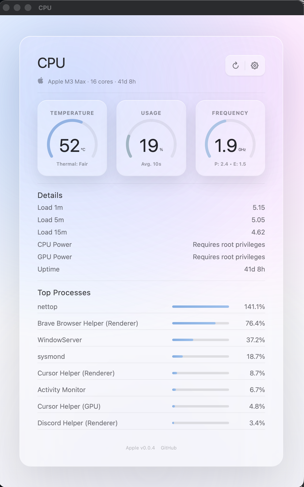
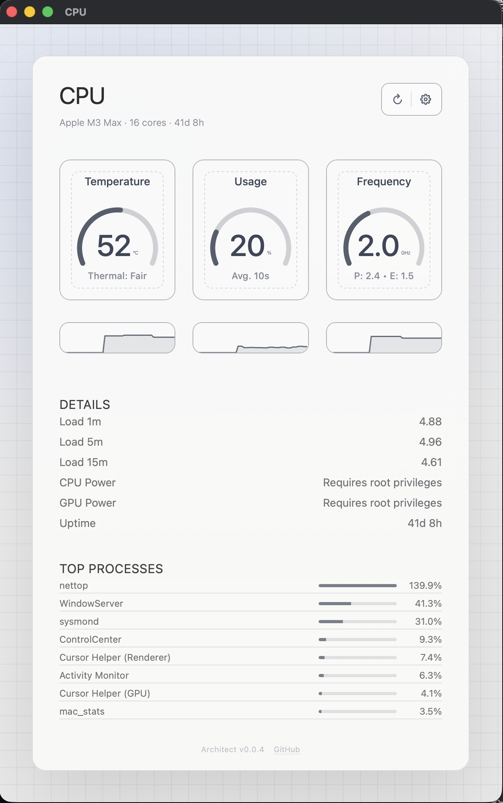
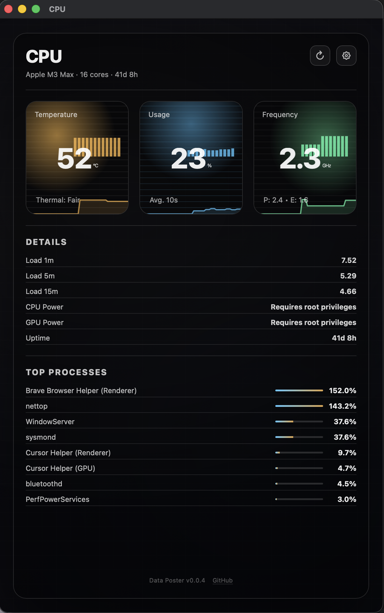
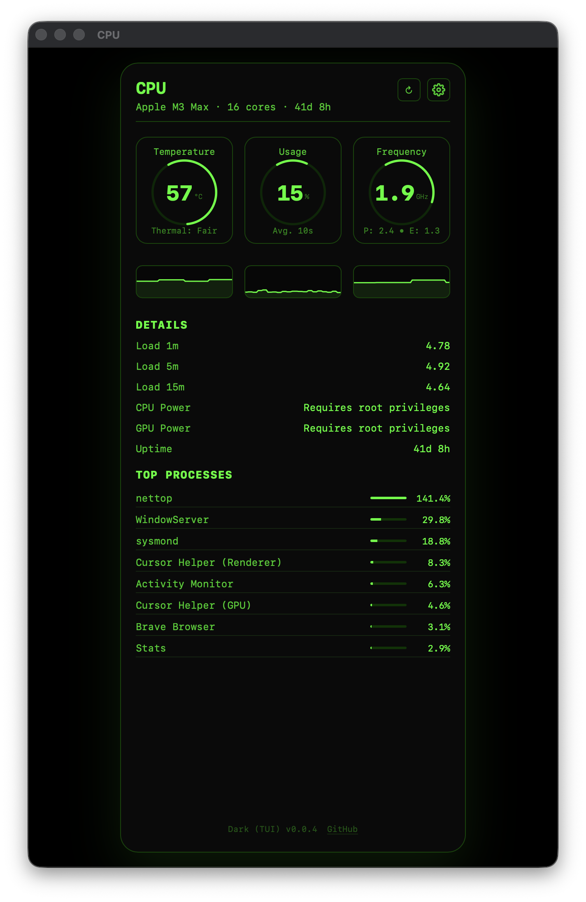
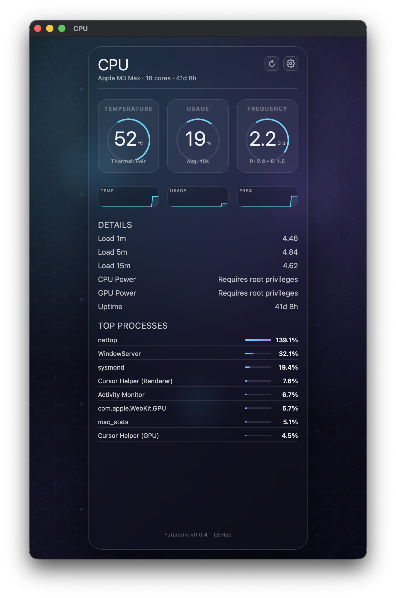
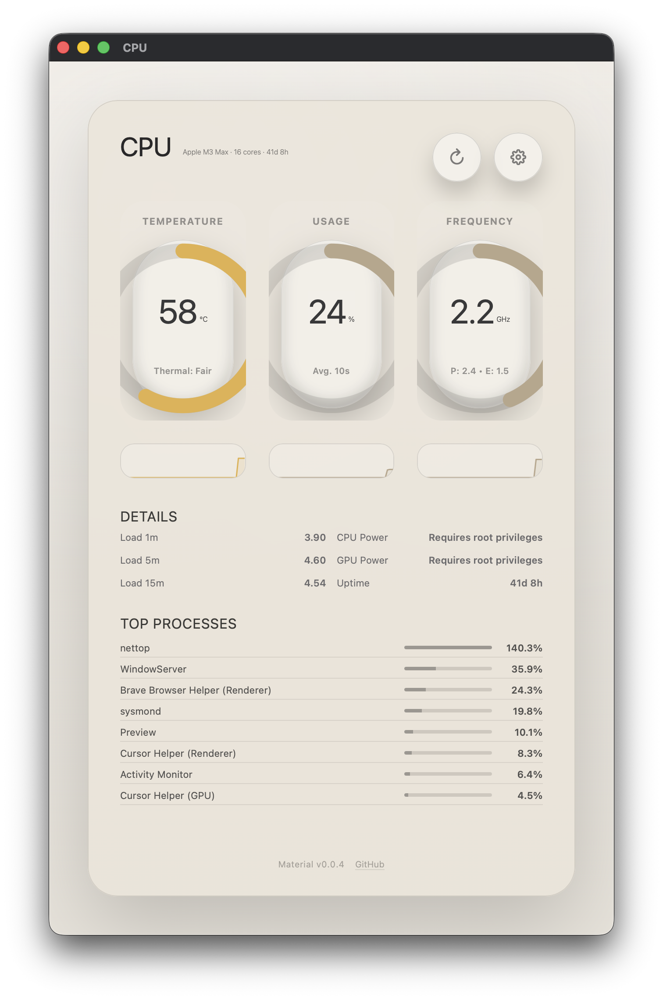
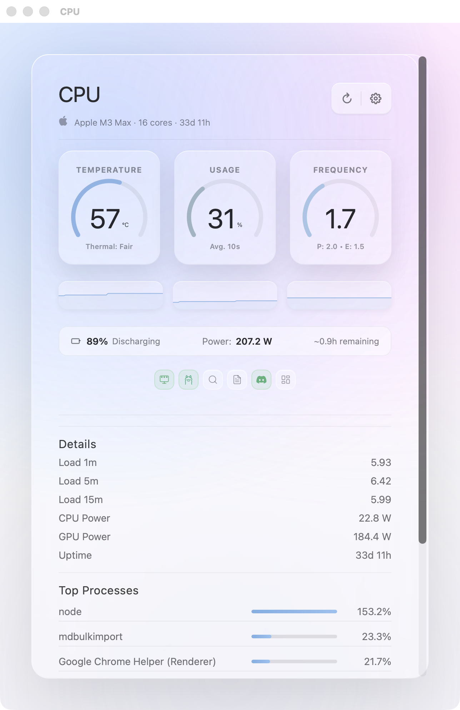
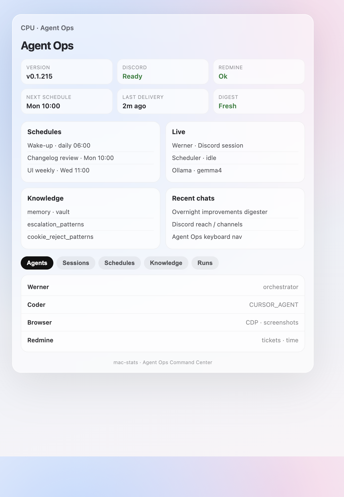
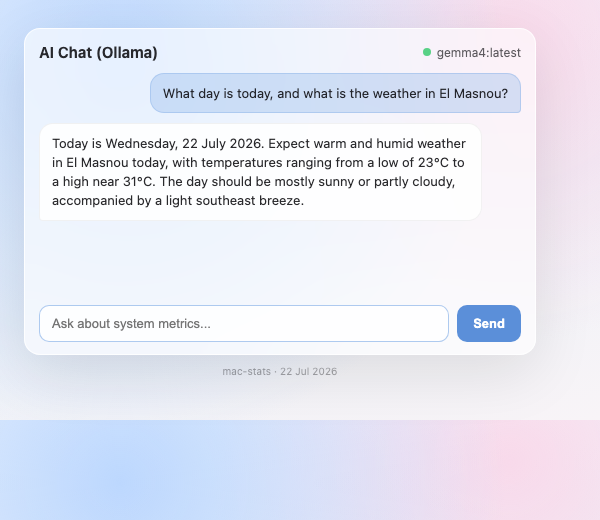
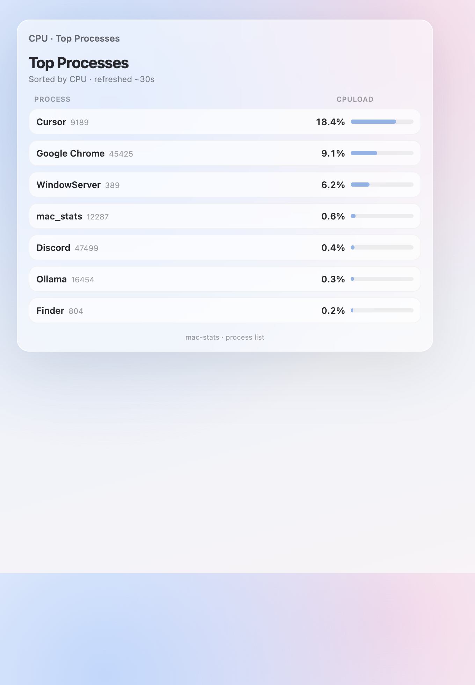

# Screenshots & themes

Screenshots and a short demo reel for [mac-stats](https://github.com/raro42/mac-stats/).

**Privacy:** Capture the **mac-stats window only** (or a dedicated feature page). Never full-desktop grabs — they can include other apps and sensitive content.

## Theme gallery

| Apple | Architect | Data Poster |
|-------|-----------|-------------|
|  |  |  |
| **Dark (TUI)** | **Futuristic** | **Light** |
|  |  |  |
| **Material** | **Neon** | **Swiss Minimalistic** |
|  |  |  |

## Feature screenshots

| CPU metrics | Disk Cleanup |
|-------------|--------------|
|  |  |
| **Agent Ops** | **AI chat (Ollama)** |
|  |  |
| **Top processes** | |
|  | |

### Short demo video

[mac-stats-features.mp4](mac-stats-features.mp4) — ~49s **live** window-only capture of the running app:

- ScreenCaptureKit recording of the CPU window (not a slideshow of stills)
- Walkthrough: live metrics → website monitors → Agent Ops → Ollama chat → back to metrics
- Letterboxed to 1920×1080; neural voiceover + ambient bed
- Repo: [github.com/raro42/mac-stats](https://github.com/raro42/mac-stats/)

Also linked from the [project README](../README.md#demo-video).

## How to capture (window-only)

1. Open the CPU window: `mac_stats --cpu` (or click the menu bar item).
2. **Wait at least 30 seconds** with the window open before capturing so the history graphs (temperature / usage / frequency sparklines) have enough samples and look filled-in. Do not shoot on a cold open.
3. Prefer **window capture**, not display capture:
   - ScreenCaptureKit / `screencapture -l <windowid>` for the mac-stats window only
   - Do **not** use `screencapture -D` (full display) for marketing assets
4. Optional helper for ad-hoc local shots: `./scripts/take-screenshot.sh` (full screen — avoid for repo assets).

## Refresh log

- **2026-08-05:** Added `feature-disk-cleanup.png` (window-only) for configurable cleanup scopes (Trash / Downloads / Temp / custom paths) — v0.1.355+.
- **2026-07-28:** Agent Ops empty-state polish shipped (v0.1.261). Window-only recapture of `feature-agent-ops.png` deferred — agent-session `screencapture` returned black frames (Screen Recording / TCC); keep prior asset until a permitted capture.
- **2026-07-26:** Recaptured `feature-cpu-metrics.png` (window-only, post SSD menu-bar / v0.1.257+).
